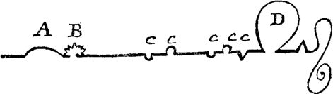

Academia and traditional publishing are pushing out homogenized products that are notable for their historic quantity as well as their historically anemic content.
Like any big business, these industries produce what’s safe; like any elite form of communication, there is a formula to which one must adhere.
Novels were their boldest and most disruptive when they were new: in the seventeenth and eighteenth centuries, novels were the province of children and women. Respectable men would never be caught reading novels.

> “Have you ever read Udolpho, Mr. Thorpe?”\
> “Udolpho! Oh, Lord! Not I; I never read novels; I have something else to do.”\
> —Jane Austen, *Northanger Abbey,* Ch. 7

We might recall *Don Quixote* 1605-15, in which a regular man goes insane from reading too many chivalric novels—this is the archetypical fear associated with new and rising media, here seen in the seventeenth century not long after the printing press was invented.
And the issue is never what rich people will do with this technology; the problem is always what the poor and the uneducated will get up to. They, after all, don’t know the difference between fantasy and reality.
And yet when novels became a prestige medium only after Austen, they lost their original, experimental nature. Sterne’s *Tristram Shandy* from 1759 had no real plot; the book was filled with nonsense digressions and crazy illustrations like this one:

>\
>
>These were the four lines I moved in through my first, second, third, and fourth volumes.4—In the fifth volume I have been very good,——the precise line I have described in it being this:\
>
>

This is why Laurence Sterne has been described as a forerunner to the postmodernists—this sort of stuff is legible to us now as wildly experimental and daring, and would likely be picked up by a publisher as a dauntless denial of form itself.
However, this was not a rejection of the novel form. To the contrary, there was no novel form; the novel was a relatively new invention.

Before Sterne, Samuel Richardson what is still one of the longest novels in the English language, *Clarissa,* an epistolary novel about a woman who is kidnapped and assaulted.
Several of the letters come from her, but the letters, at one point, are replaced with journal entries, as her kidnapper is stopping her communications.
The most famous letter renders a form for trauma itself that would, today, still be seen as shocking and inventive:

>

These sorts of wild swings become less and less common as the novel settles into its prestige form. Now, novels are hardly subversive at all—to write a novel and have it published, likely after an MFA or similar, puts one among the literary elite and in the hands and houses of the educated and the wealthy.
Where, then, are the children who once read novels and were mocked for it?

Today they read manga, fantasy, romance, and comic books. Some read science fiction, but they must work assiduously to avoid that prestige science fiction that has taken up the imaginations of a whole class of American businessmen.
They need to find the descendants of the pulps that entertain not out of necessity, as an unfortunate precondition of a more serious enterprise, but because it is their primarily purpose.

Once it was normal for works of fiction to be serialized—sometimes published in multiple volumes and, more frequently particularly in the nineteenth century, in periodicals.
By the twentieth century, the novels being published this way were primarily works of “genre” fiction—science fiction, fantasy, horror, etc. And yet prestige novels shied away from this mode of presentation, opting for a singular and continuous present of the vision of an auteur.

Online publishing enters this history at a moment where it, too, is the object of many people’s fear. Most anybody can write anything; the public can be manipulated; echo chambers develop; propagandists have a simultaneously easier and harder job in managing public sentiments.
And each of us are inundated with media constantly, textual and visual. The panic reminds one of an issue of Addison and Steele’s *Tatler,* in which the authors compare Don Quixote’s ailment with what was happening to the reading public of England now that newspapers were easily obtainable:

>As much as the case of this distempered knight is received by all the readers of his history as the most incurable and ridiculous of all phrensies, it is very certain we have crowds among us far gone in as visible a madness as his, though they are not observed to be in that condition.
>As great and useful discoveries are sometimes made by accidental and small beginnings, I came to the knowledge of the most epidemic ill of this sort, by falling into a coffee-house where I saw my friend the upholsterer, whose crack towards politics I have heretofore mentioned.
>This touch in the brain of the British subject is as certainly owing to the reading newspapers, as that of the Spanish worthy above mentioned to the reading works of chivalry.
>
>[…]
>
>What I am now warning the people of is, that the newspapers of this island are as pernicious to weak heads in England as ever books of chivalry to Spain; and therefore shall do all that in me lies, with the utmost care and vigilance imaginable, to prevent these growing evils.
> —*Tatler* No.178

(N.B. Neither Cervantes nor Addison and Steele are actually participating in a moral panic. Of course they both are writing in the genres that they are referencing. What we see here are not examples of the panic but representations of it.)

And like with newspapers and novels, our culture will likely learn to accept and later extol these forms. Now, a reader of a novel is a high-class intellectual; a reader of a newspaper is well-informed.
In the distant future, the readers of comic books will likely be viewed in the same way, as some other, “lower” art form becomes the day’s great concern.

For now, we enjoy the deviance of these new forms, before they gain the prestige that forces them into isometric boxes.
We might compare the online posts like this one to essays, the form pioneered by Montaigne, named for assaying, what one does to test the quality of a metal, but, here, an idea is what is tested.
The five-paragraph form is the dumbing-down of a prestige form, the academic argument; but the original essay was a kind of experiment that led where it would.

And yet the context of reading cannot be neglected here. Montaigne’s essays would have been purchased by a noble in a large, bound volume, and perused that way.
Likely a book like this, like any other in the period, would not have been read straight through, but flipped through, something like a reference document or an art book.
There is similarity between that and the internet—an object that is searched through until one finds something interesting. But the differences are obvious.
The internet is not one man’s work, but the work of an entire society.
